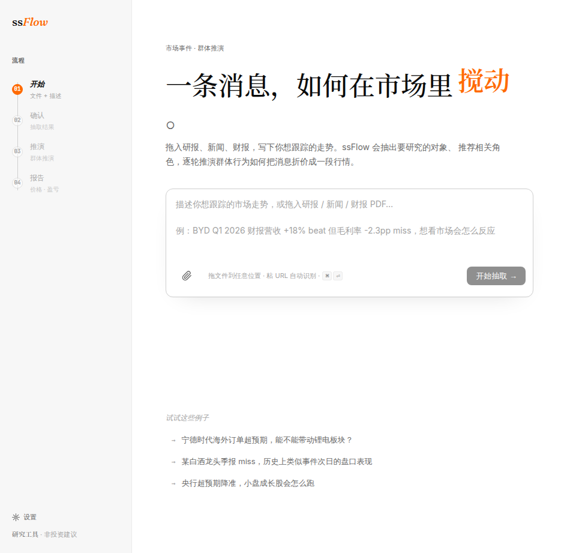
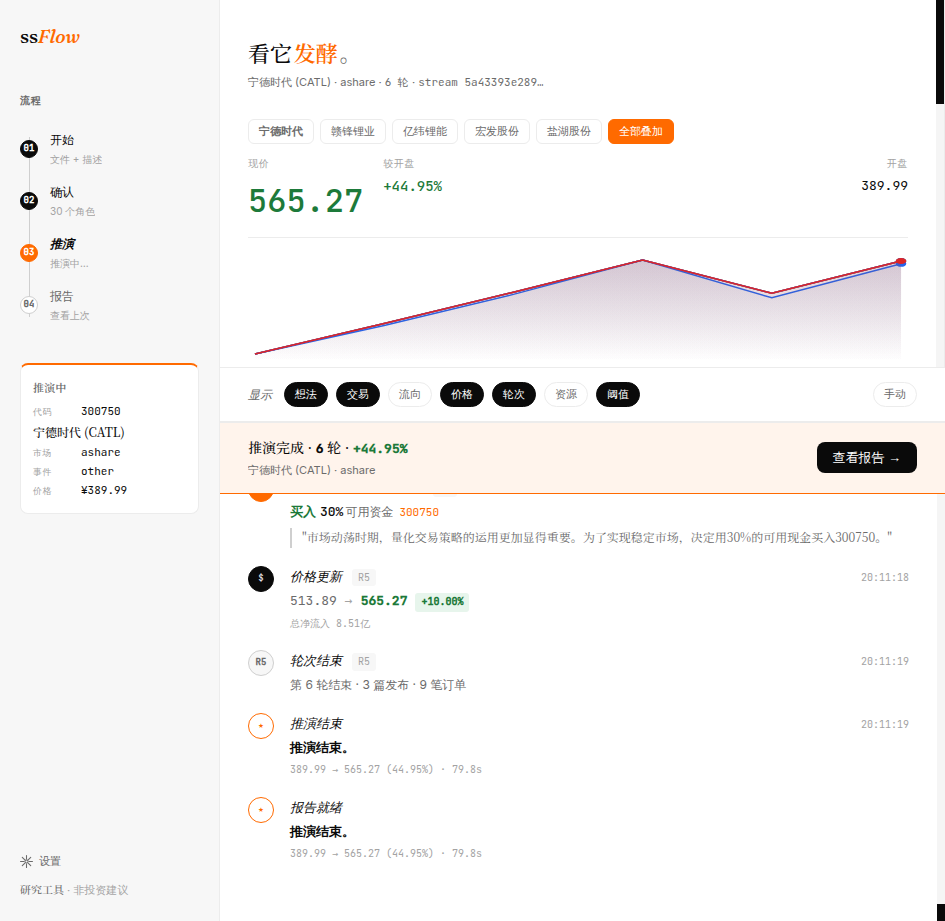
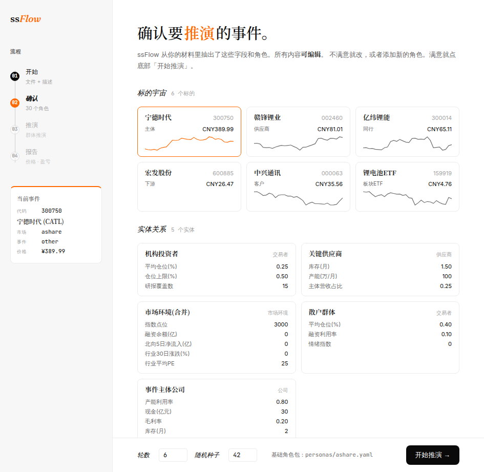

# ss*Flow*

一条消息，如何在市场里发酵。

> Feed it a headline. Watch AI personas react, post, and trade.
> Price emerges from order flow. Works across markets — A-shares, US equities, commodities.



## How it works

1. **Seed** — paste a market event (earnings beat, policy rumor, analyst downgrade)
2. **Simulate** — AI personas read each other's posts, form opinions, and trade
3. **Read** — round-by-round narrative of who said what, who traded, and what happened to the price



## Quickstart

```bash
uv sync --extra dev
cp .env.example .env       # add your OpenAI-compatible API key
uv run pytest -q           # verify setup
uv run python scripts/run_one.py \
    --input "BYD Q1 财报: 营收 +18% beat, 毛利率 -2.3pp miss" \
    --confirm
```

Cost per simulation: ~$0.08–0.15 on `gpt-4o-mini`. Wall clock: ~60–90 seconds.

<details>
<summary>Web UI</summary>

```bash
SSFLOW_BUDGET_USD=5.0 uv run python -c \
    "from api.app import app; app.run(host='127.0.0.1', port=5000)"
```

Open `http://127.0.0.1:5000`. Paste event text, review extracted parameters, run.

</details>

<details>
<summary>Explicit parameter mode (skip auto-extraction)</summary>

```bash
uv run python scripts/run_one.py \
    --event /dev/stdin \
    --ticker 002594 \
    --event-type earnings \
    --event-date 2026-04-29 \
    --personas personas/ashare.yaml \
    --current-price 218.50 \
    --adv 8000000000 \
    --rounds 5 <<'EOF'
BYD Q1 2026 earnings: 营收 +18% beat consensus 12%, 毛利率 -2.3pp miss,
汽车业务销量 +15% YoY, 海外占比提升至 30%.
EOF
```

</details>

## 推演生态



A cast of AI personas, each with distinct information access, biases, and capital:

- **Traders** — 散户追涨, 中产配置, 高净值价投, 公募主动权益, ETF做市, 私募, 险资/社保, 北上/QFII, 量化, 产业资本, 国家队...
- **Media** — 财联社, 新华社, Bloomberg CN, 第一财经
- **Analysts** — 中信建投, 中金, 国信
- **Regulators** — 证监会, 央行, 发改委, 工信部
- **KOLs** — 雪球大V, 微博财经, 公众号深度

Every round, each persona reads its feed (filtered by a follow graph — information
asymmetry is structural), publishes reactions, and (for traders) submits order flow.
Net flow feeds a Kyle square-root price impact model (limit rules are market-specific,
e.g. ±10% for A-shares). The new price posts back into the feed. Repeat.

The output reads like a financial media feed, not a spreadsheet.

<details>
<summary>Architecture</summary>

```
                  event text / URL
                         │
                         ▼
               ┌─────────────────────┐
               │  event_extractor    │  LLM + web search
               │   (Stage 0)         │  auto-fills market / price / ADV
               └─────────┬───────────┘
                         │
                         ▼
               ┌─────────────────────┐
               │ personas/ashare.yaml│  30 personas, follow graph
               │  schema v3           │
               └─────────┬───────────┘
                         │
                         ▼
        ┌────────────────────────────────────┐
        │  oasis_engine.run_simulation       │
        │                                     │
        │  ┌──────────────────────────────┐  │
        │  │ OASIS env.step()             │  │
        │  │ — each persona acts          │  │
        │  │ — social + trading in one    │  │
        │  │   unified LLM decision       │  │
        │  └──────────────┬───────────────┘  │
        │                 │                    │
        │                 ▼                    │
        │  ┌──────────────────────────────┐  │
        │  │ drain orders → Kyle model    │  │
        │  │ → new price → post to feed   │  │
        │  └──────────────────────────────┘  │
        └────────────────────────────────────┘
                         │
                         ▼
              narrative markdown report
              + scorecard.db + oasis_dbs/
```

**Modules:**

- `src/ssflow/oasis_engine.py` — main async simulation loop
- `src/ssflow/trading_layer.py` — agent population model, Kyle price impact
- `src/ssflow/oasis_lm.py` — CAMEL LM backend with cost tracking
- `src/ssflow/oasis_trading_tool.py` — `submit_order_distribution` FunctionTool
- `src/ssflow/oasis_persona_adapter.py` — YAML → OASIS AgentGraph
- `src/ssflow/oasis_feed_reader.py` — follow-graph-filtered feed queries
- `src/ssflow/report.py` — feed-first narrative renderer
- `src/ssflow/scorecard.py` — SQLite run tracker
- `personas/ashare.yaml` — 30-persona A-share pack (hand-tuned)
- `personas/us-equity-*.yaml` — US equity packs
- `personas/crude-oil-wti-*.yaml` — WTI crude oil packs

Social layer: [OASIS](https://github.com/camel-ai/oasis) (`camel-oasis` ≥0.2.5, unforked).

</details>

<details>
<summary>Persona pack authoring</summary>

The main pack is `personas/ashare.yaml`. To create a new pack:

```bash
cp personas/_template.yaml personas/my-market.yaml
$EDITOR personas/my-market.yaml
uv run python -c "from ssflow.persona import load_personas; print(len(load_personas('personas/my-market.yaml')))"
```

See `personas/SCHEMA.md` for the field reference. There's also an auto-generation
pipeline: `scripts/generate_pack.py --market us-equity --output personas/us-equity-auto.yaml`.

</details>

<details>
<summary>Python version + framework pins</summary>

- Python **≥3.12, <3.13** (`tiktoken` wheels)
- `camel-oasis ≥0.2.5` (unforked, official `tools` + `FunctionTool`)
- `openai ≥1.50.0` (sync + async)

</details>

## ⚠️ 合规声明

研究推演工具，非投资建议。所有输出经过 `output_filter.assert_compliant`
合规过滤。含有禁用词汇（建议/推荐/买入/卖出/目标价/评级/BUY/SELL/target price/recommend）的内容会被自动拦截。

模拟价格轨迹是思想实验，不是预测。

## License

MIT. See `LICENSE`.
